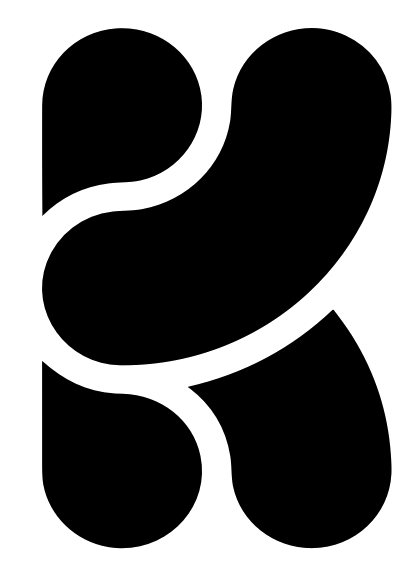

<section class="hero">
  

    
Donostia–San Sebastián · Spain · <a href="mailto:igarciaf896@gmail.com">igarciaf896@gmail.com</a>

    

      PhD in Natural Language Processing (NLP) by <a href="https://www.ehu.eus/en/en-home">University of the Basque Country UPV/EHU</a>, <a href="http://www.ixa.eus/?language=en">IXA Group</a>, and <a href="http://www.hitz.eus/">HiTZ Basque Center for Language Technologies</a>.
      During my time at HiTZ, I specialized in data acquisition, training, and evaluation of Large Language Models (LLMs). Notable contributions include: <a href="https://hitz-zentroa.github.io/GoLLIE/">GoLLIE</a>, a 34B-parameter LLM achieving state-of-the-art results in zero-shot Information Extraction; <a href="https://huggingface.co/HiTZ/Medical-mT5-xl">MedMT5</a>, the first open-source multilingual text-to-text model for the medical domain; and <a href="https://arxiv.org/abs/2506.07597">Latxa</a>, a Basque instruction-tuned model trained on the <a href="https://leonardo-supercomputer.cineca.eu/hpc-system/">Leonardo Supercomputer</a> using up to 512 GPUs and 128 nodes, delivering performance comparable to GPT-4o and Claude Sonnet.
        
      At <a href="https://www.krea.ai">Krea.ai</a>, I am currently developing a personalized image recommendation engine based on user interaction data and deep learning methods. I have designed and trained SigLIP-style embedding models for artistic style-based image retrieval, and contributed to the development and optimization of codebases for fine-tuning video (Wan 2.1) and image (Flux) models, with a focus on performance improvements and distributed training using techniques such as FSDP2. I also implemented and deployed generation services for 3D models and textures, which power features used by thousands of users on the Krea platform.
        
      In my free time, I develop <a href="https://veridika.ai">veridika.ai</a>, an AI agent framework for real-time fact-checking.
    

  

  

    
    

      
      
      
      
    

    

      
      
      
      
      
      
    

  

</section>

