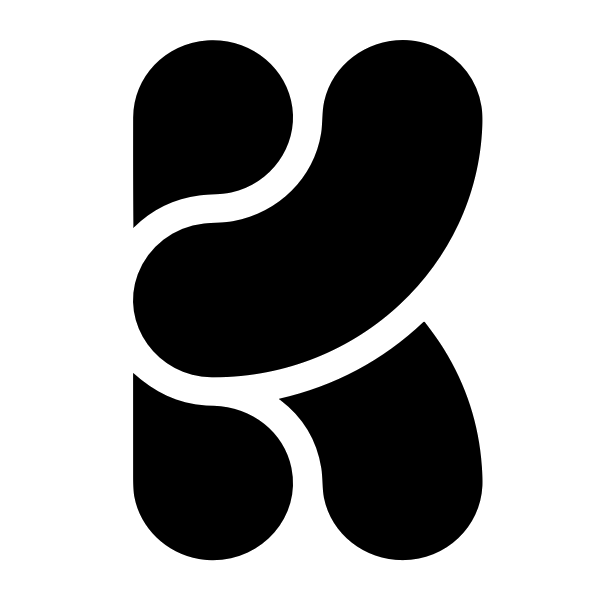

<table>
  <tr>
    <td style="width:50%"> PHD in Natural Language Processing by the University of the Basque Country   Donostia-San Sebastián</a>    <a href="mailto:igarciaf896@gmail.com"> igarciaf896@gmail.com</a>    
     
     
      <a href="https://multiversecomputing.com">   
    </td>
    <td style="width:50%"> </td>
  </tr>
 </table>

<h2 style="text-align: center;">About Me</h2>

PhD in Natural Language Processing (NLP) by [University of the Basque Country UPV/EHU](https://www.ehu.eus/en/en-home), [IXA Group](http://www.ixa.eus/?language=en), and [HiTZ Basque Center for Language Technologies](http://www.hitz.eus/). During my time at HiTZ, I specialized in data acquisition, training, and evaluation of Large Language Models (LLMs). Notable contributions include: [GoLLIE](https://hitz-zentroa.github.io/GoLLIE/), a 34B-parameter LLM achieving state-of-the-art results in zero-shot Information Extraction; [MedMT5](https://huggingface.co/HiTZ/Medical-mT5-xl), the first open-source multilingual text-to-text model for the medical domain; and [Latxa](https://arxiv.org/abs/2506.07597), a Basque instruction-tuned model trained on the [Leonardo Supercomputer](https://leonardo-supercomputer.cineca.eu/hpc-system/) using up to 512 GPUs and 128 nodes, delivering performance comparable to GPT-4o and Claude Sonnet.

At [Krea.ai](https://www.krea.ai), I am currently developing a personalized image recommendation engine based on user interaction data and deep learning methods. I have designed and trained SigLIP-style embedding models for artistic style-based image retrieval, and contributed to the development and optimization of codebases for fine-tuning video (Wan 2.1) and image (Flux) models, with a focus on performance improvements and distributed training using techniques such as FSDP2. I also implemented and deployed generation services for 3D models and textures, which power features used by thousands of users on the Krea platform.

In my free time, I develop [veridika.ai](https://veridika.ai), an AI agent framework for real-time fact-checking.

<h2 style="text-align: center;">Social Profiles</h2>

